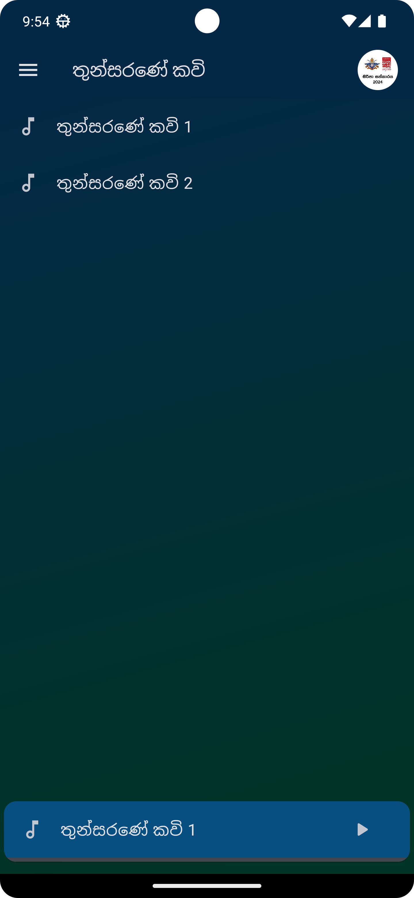
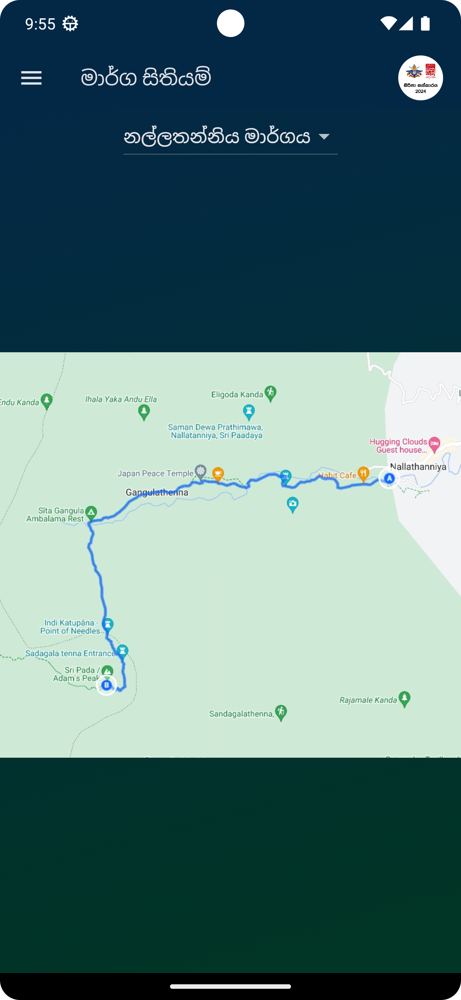

# Siripa Sathkaraya

A mobile application for Sri Pada pilgrims.

Developed for the project in collaboration with various clubs of General Sir John Kotelawala Defence University and Manusathderana.

## Features

- **තුන්සරණේ කවි**: Collection of devotional songs.
- **සිරිපා වන්දනා ගාථාව**: Sri Pada pilgrimage chants.
- **මාර්ග සිතියම්**: Route maps for the pilgrimage.
- **සිරිපා අඩවිය රකිමු**: Information on protecting the Sri Pada site.
- **ව්‍යාපෘතිය ගැන**: Information about the project.

## Download

Download Siripa Sathkaraya app from the [Google Play Store](https://play.google.com/store/apps/details?id=github.io.ramith_gunawardana.siripa_sathkaraya.siripa_sathkaraya)

## Getting Started

## Prerequisites

- [Flutter](https://flutter.dev/docs/get-started/install)
- [Dart](https://dart.dev/get-dart)
- Android Studio or VS Code for Android development or Xcode for iOS development

### Installation

1. Clone the repository:
    ```sh
    git clone https://github.com/Ramith-Gunawardana/siripa_sathkaraya.git
    ```
2. Navigate to the project directory:
    ```sh
    cd siripa_sathkaraya
    ```
3. Install dependencies:
    ```sh
    flutter pub get
    ```

### Running the App

To run the app on an emulator or a physical device, use the following command:
```sh
flutter run
```

### Building the App

To build the app for Android and iOS, use the following commands:
 - Android:
   ```sh
    flutter build apk
    ```
 - iOS:
   ```sh
    flutter build ios
    ```

## Packages

- [flutter](https://flutter.dev/) - Flutter framework for building natively compiled applications for mobile, web, and desktop from a single codebase.
- [provider](https://pub.dev/packages/provider) - A wrapper around InheritedWidget to make them easier to use and more reusable.
- [audioplayers](https://pub.dev/packages/audioplayers) - A Flutter plugin to play multiple audio files simultaneously.
- [package_info_plus](https://pub.dev/packages/package_info_plus) - A Flutter plugin to get the version of the app.
- [url_launcher](https://pub.dev/packages/url_launcher) - A Flutter plugin for launching a URL in the mobile platform.
- [flutter_native_splash](https://pub.dev/packages/flutter_native_splash) - Automatically generates native code for adding splash screens in Android and iOS.
- [flutter_launcher_icons](https://pub.dev/packages/flutter_launcher_icons) - A package which simplifies the task of updating your Flutter app's launcher icon.
  
## Screenshots


<p>






</p>

## License

This project is licensed under the MIT License. See the [LICENSE](LICENSE) file for details.
